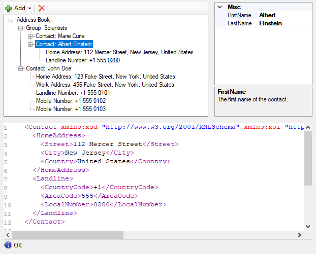

# NanoByte Structure Editor

[](https://www.nuget.org/packages/NanoByte.StructureEditor.WinForms/)
[](https://structure-editor.nano-byte.net/)
[](https://ci.appveyor.com/project/nano-byte/structure-editor)  
NanoByte Structure Editor is a WinForms library that helps you build split-screen editors for your data structures, consisting of:

1. a collapsible tree-view of the data structure,
2. a graphical editor for the currently selected node in the tree (`PropertyGrid` or custom) and
3. a text editor (based on [ICSharpCode.TextEditor](https://github.com/nano-byte/ICSharpCode.TextEditor)) with a serialized (XML) representation of the currently selected node.

This allows you to create an IDE-like experience for your users when editing complex domain specific languages, configuration files, etc..



## Usage

Add a reference to the [NanoByte.StructureEditor.WinForms](https://www.nuget.org/packages/NanoByte.StructureEditor.WinForms/) NuGet package to your project. It is available for .NET Framework 2.0+.

### Initialization

Create an instance of `StructureEditor<T>` and add it to your Form:
```csharp
var editor = StructureEditor<MyData>();
Controls.Add(editor);
```

Alternatively, you may want to derive your own class from `StructureEditor<T>`. This will allow you to use the graphical WinForms designer in Visual Studio (which does not support generic types) to place the Editor on your Form.
```csharp
public class MyDataEditor : StructureEditor<MyData>
{}
```

You need to "describe" your data structure to the Editor. You can do this directly after instantiating the editor or in the constructor of your derived class.
- Call `DescribeRoot()` and then use the fluent API provided as a return value to describe the properties on your main data type.
- Call `Describe<TContainer>()` to describe the properties on a data type `TContainer` exposed by another property. You can use multiple calls with different type parameters to describe arbitrarily deep hierarchies.  

The fluent API provides the following methods:
- `.AddProperty()` describes a simple value property.
- `.AddPlainList()` describes a non-polymorphic list.
- `.AddList()` describes a polymorphic list. After calling it you need to chain `.AddElement()` calls for each specific type of element the list can hold.

There are numerous overloads for each of these methods, e.g., allowing you to specify a custom editor control for a data type or to keep the auto-generated one.

```csharp
editor.DescribeRoot("Address Book")
      .AddPlainList("Group", x => x.Groups);
editor.Describe<IContactContainer>()
      .AddPlainList("Contact", x => x.Contacts);
editor.Describe<Contact>()
      .AddProperty("Home Address", x => PropertyPointer.For(() => x.HomeAddress))
      .AddProperty("Work Address", x => PropertyPointer.For(() => x.WorkAddress))
      .AddList(x => x.PhoneNumbers)
      .AddElement("Landline Number", new LandlineNumber())
      .AddElement("Mobile Number", new MobileNumber());
```

### Storage

Use the `Open()` method to load an XML file into the editor:
```csharp
editor.Open(CommandManager<AddressBook>.Load(path));
```

Use the `Save()` method on the `CommandManager` property to save the editor's content as an XML file:
```csharp
editor.CommandManager.Save(path);
```

Take a look a the [sample project](src/Sample) for a more complete setup, including undo/redo functionality.

## Building

The source code is in [`src/`](src/), config for building the API documentation is in [`doc/`](doc/) and generated build artifacts are placed in `artifacts/`. The source code does not contain version numbers. Instead the version is determined during CI using [GitVersion](http://gitversion.readthedocs.io/).

To build install [Visual Studio 2019 v16.5 or newer](https://www.visualstudio.com/downloads/) and run `.\build.ps1`.

## Contributing

We welcome contributions to this project such as bug reports, recommendations and pull requests.

This repository contains an [EditorConfig](http://editorconfig.org/) file. Please make sure to use an editor that supports it to ensure consistent code style, file encoding, etc.. For full tooling support for all style and naming conventions consider using JetBrain's [ReSharper](https://www.jetbrains.com/resharper/) or [Rider](https://www.jetbrains.com/rider/) products.
